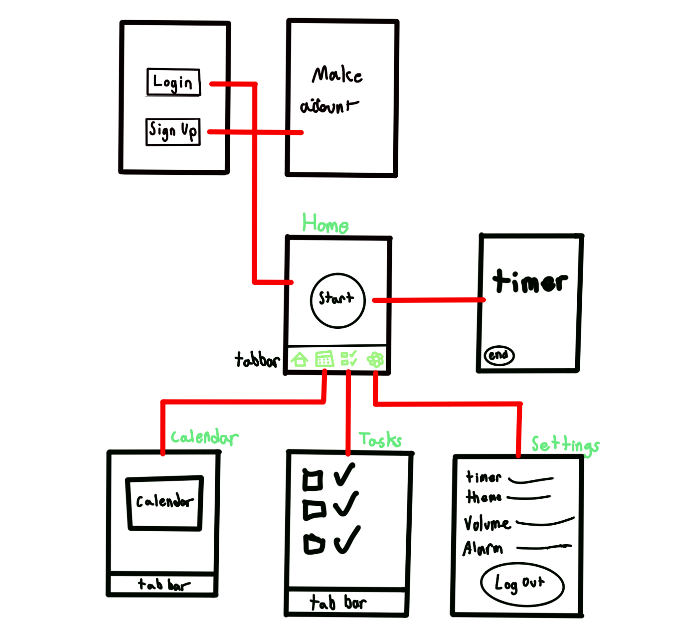

# Capstone-Assignment-Pomodoro

## Table of Contents

1. [Overview](#Overview)
2. [Product Spec](#Product-Spec)
3. [Wireframes](#Wireframes)
4. [Schema](#Schema)

## Overview

### Description

The purpose of this Pomodoro Application is to create a healthy and effective study habit for people who are looking to focus. As a college student, it can be difficult to study without any incentive or obligation to. With the help of the "Pomodoro Method," I and many other users can benefit from the method for an effective and efficient way of studying.

### App Evaluation

- **Category:** Productivity
- **Mobile:** Mobile is required for this app as it would be intended to study anywhere at anytime. Mobile phones provide that criteria, and would be convenient in long-term. It would make use of real-time and push.
- **Story:** The value of this app would be received positively as there are many users (such as college students) who could benefit from this idea. In terms of peer review, I believe they would benefit from the idea as well since they are university students.
- **Market:** This app is designed to target people who do not have a firm structure of studying. The Pomodoro app could be their introduction to an effective study habit.
- **Habit:** This app would be meant to be used often (whenever studying is needed). It would be something to push in to and leave in the background.
- **Scope:** The idea of a Pomodoro app is not technically challenging as the coding logic and conceptual idea around it is not difficult. The structure I am planning is clearly defined to make it easy to use for the user.

## Product Spec

### 1. User Stories (Required and Optional)

**Required Must-have Stories**

*As a college student with a hectic schedule, I want to efficiently manage my study sessions and breaks to enhance productivity. 
*To achieve this, I'd like to use a Pomodoro application that aligns with my academic needs. These needs can be consisted of:
1.**Effective Study Habits**
  - As a user, I would like to integrate a healthy and effective study habit to assist my academic studies.
2.**Task List Integration**
  - The option of making a list of tasks I want to acheive during my study sessions would create a bigger incentive to stay focused and study.
3.**User-Friendly Inteface**
  - Having a clean and easy to use interface would encourage the increased use of the application as it would not be too complicated to set up a Pomodoro timer.

### 2. Screen Archetypes

- [ ] Login
* User can login
- [ ] Registration Screen
* User can create a new account
- [ ] Calendar
* Visualize dates or events into calendar form
- [ ] Settings
* User can configure app options

### 3. Navigation

**Tab Navigation** (Tab to Screen)

* Home Screen
* Calendar
* Tasks
* Settings

**Flow Navigation** (Screen to Screen)

- [ ] Login Screen
* => Home
- [ ] Registration Screen
* => Home
- [ ] Home Screen
* => Timer
* => Calendar
* => Tasks
* => Settings 
- [ ] Calendar Screen
* => Home
* => Tasks
* => Settings
- [ ] Tasks Screen
* => Home
* => Calendar
* => Settings
- [ ] Settings Screen
* => Home
* => Calendar
* => Tasks 

## Wireframes

[Add picture of your hand sketched wireframes in this section]

## Schema 

[This section will be completed in Unit 9]

### Models

[Add table of models]

### Networking

- [Add list of network requests by screen ]
- [Create basic snippets for each Parse network request]
- [OPTIONAL: List endpoints if using existing API such as Yelp]
